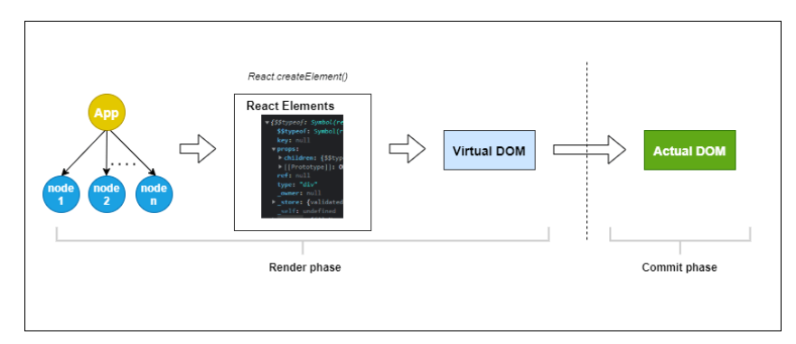
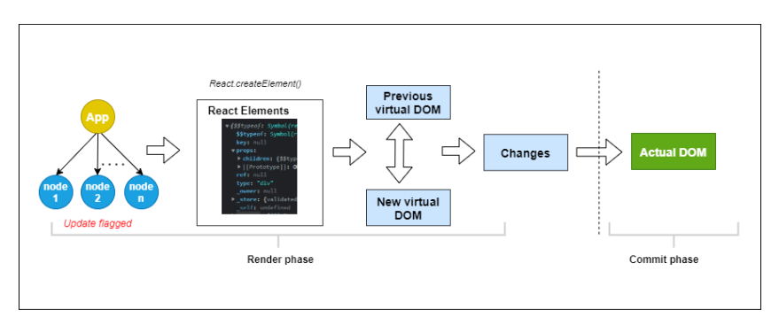

# Inception-1 Notes

## Extra_Stuff

1.  How react render works ? [https://www.telerik.com/blogs/understand-how-rendering-works-react#:~:text=Rendering%20is%20React]

    >

        - React’s Rendering Process :

        
        

        - Render Phase: 1. It is initial phase in which jsx code==> js code. 2. It initially starting from root component and works way down building react element tree-- [Virtual DOM] 3. In rerendering phase it creates new js representation of dom , it uses process k/as **diffing** to identify changes in new and old virtual DOM.

        - Virtual DOM:
              1. Writing to the actual DOM is very expensive and can lead to performance shortcomings, but generating the plain JavaScript objects (virtual DOM) is really easy
              2. with help of virtual dom react only update the elements in DOM which get updated in virtual dom.

         - Reconciliation:
            1. It is process through which virtual dom update real dom using algo which is diffing algorithm.

## Assignments :

1.  What is Emmet?
    -->Emmet is a plugin for many popular text editors which greatly improves HTML & CSS workflow:

2.  Difference between a Library and Framework?
    ---> Both library and framework are preocode software support for developer. In case library it mainly focus on improving specific functionality whereas framwork provide everything require for building full fledge application.

3.  What is CDN? Why do we use it?
    --> A content delivery network (CDN) is a network of interconnected servers that speeds up webpage loading for data-heavy applications. CDN can stand for content delivery network or content distribution network.

        - Why do we use it ?
        --> The primary purpose of CDN is to reduce latency and reduce delay in the communication between server and client.
         - What cdn does ?
        --> CDN works as intermediatery server between client and website server.  CDN manages some of the communication between client and server. It reduce the network on ur web server and reduce bandwidth consumption and in this way increases the user experience of ur application.
            -->      IT does following things:
                        -Reduce page load time
                        -Reduce bandwidth costs
                        -Increase content availability
                        -Improve website security
        - What content can cdn deliver?
        --> Static and dynamic

        - How does it work ?
        --> Content delivery networks (CDNs) work by establishing a point of presence (POP) or a group of CDN edge servers at multiple geographical locations. This geographically distributed network works on the principles of caching, dynamic acceleration, and edge logic computations.

4.  What is crossorigin in script tag?
    --> The crossorigin attribute in the HTML script tag is not used to disable or enable CORS (Cross-Origin Resource Sharing). Instead, it is used to indicate whether the browser should make a CORS request when fetching the script file.
    If you include a script in your HTML file with the crossorigin attribute set, the browser will treat the script as a cross-origin request and include the appropriate CORS headers in the request. This is useful when loading scripts from a different domain.
5.  Why is react k/as react ?
    --> The name reflects the libraries core concepts i.e reacting to changes of data or state and updating accordingly.

6.  What is diference between React and ReactDOM
    --> React is a core library for making user interfaces and reactdom is renderer or rendering library specifically for web application use to interact with the DOM.It has method called render. For other platforms like mobiles we use ReactNative.

7.  What is difference between react.development.js and react.production.js files via CDN ?
    ---> One is suitable for developement there is additional codes in that where as in production code is an optimized code here the uneccessary things is removed.

8.  What is async and defer ?
    ---> Both async and defer are boolean attributes that can be applied to the script tag to control the behavior of script loading and execution.7
    ---> 
    a. async is not take care of order of execution of scripts , when u have to use some external scripts. ex: s
    b. defer is take care of order of execution of scripts.

9.  Why css use in head tag and script in body tag ?
    --> a. Css use in head tag because before loading the main content i.e body the styling should get applied to the elements.
    b. Js is there in the end of body tag so that after parsing whole html we can load script over network which could take a long time to load.

10. Arrow Function:
    Limitation of above:
    a. Arrow functions don't have their own bindings to this, arguments, or super, and should not be used as methods.
    b. Arrow functions cannot be used as constructors. Calling them with new throws a TypeError. They also don't have access to the new.target keyword.
    c. Arrow functions cannot use yield within their body and cannot be created as generator functions.
