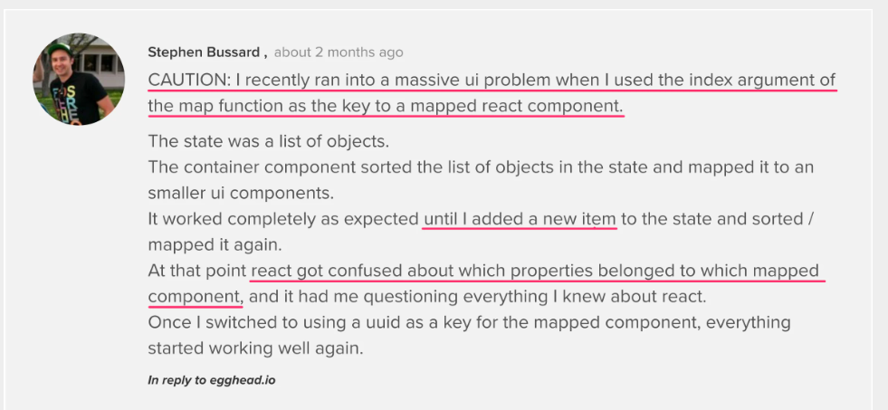

# Lec-4:

1.  Is JSX mandatory for React?
    ==>No , JSX is an extension of javascript which makes it easy to create react element.

2.  Is ES6 mandatory for React?
    ==> No , It can written without ES6. we use We use create-react-class instead of ES6.

3.  How to write comment is JSX?
    ==> syntax {/\* \*/} to wrap around the comment text.

4.  What is <React.Fragment></React.Fragment> and <></> ?
    ==> My explaination:
    a. From functional component You can not return more than 1 element if u want to return more than 1 child then u have to wrap up it inside 1 parent child . Why it is so because at the end functional component is just a js function so it can only return 1 obj.
    b. If you don't want to use any parent element then wrap up ur code inside

        Doc explaination:

        1.  <></> or <React.Fragment></React.Fragment> basically use to wrap up 2-3 elements so that it can be written from the function.
        2.  <> </> === <React.Fragment></React.Fragment>
        3.  U need <React.Fragment></React.Fragment> this when u want to pass the keys.
        4.  Usually you won’t need this unless you need to pass a key to your Fragment.

            - ex : Example to use this : <> </>

                     ```
                    function CloseDialog() {
                    const buttons = (
                     <>
                       <OKButton />
                       <CancelButton />
                     </>
                    );
                    return (
                     <AlertDialog buttons={buttons}>
                       Are you sure you want to leave this page?
                      </AlertDialog>
                    );
                    }
                    ```

              ex-2 : Example to use <Fragment></Fragment>
              When u are using list of fragments.

                ```
                   function Blog() {
                   return posts.map(post =>
                   <Fragment key={post.id}>
                   <PostTitle title={post.title} />
                   <PostBody body={post.body} />
                   </Fragment>
                   );
                   }
                ```

5.  What is Virtual DOM?

        - React DOM - virtual DOM is an inmemory representation of real DOM.
        - DOM ?

          - DOM is programming interface(API) for web document so that programming language can interact with web page.
          - Structured representation of HTML elements created by browser after parsing whole HTML code.
          - DOM is represented in tree structure.
          - Rendering of UI on browser is very costlier operation

          - Disadvantage of DOM: - Every time some changes on some element then whole DOM tree rerender whereas Virtual DOM is use optimise this thing.
          - ```
             // Simple getElementById() method

             document.getElementById('some-id').innerValue = 'updated value';

             What happen when above code runs ?
             --> 1. Browser parses HTML to find node with this id.
                 2. It removes child element of this specific id.
                 3. Updates the parent with 'updated value'.
                 4. Recalculates the css for parent and child.
                 5. update the layout .
                 6. traverse over whole dom tree and paint it on the screen display.

                 Recalculating the CSS and changing the layouts involves complex algorithms, and they do affect the performance
            ```
             - How react solve this using virtual DOM ?

             ==> 1. Whenever some update happens then react create a new Virtual DOM.
                 2. Then this new virtual DOM is compared with older virtual DOM using diffing algorithm k/as DOM diffing.
                 3. Then the sets of min operation to update older virtual DOM to new on is stored in the Queue.
                 4. Then this operations are batch togther to minimize it further, this whole process is k/as reconcillation
                 5. Then using updated queue the react perform the actual updates on the real DOM called rendering using different rendering libraries such as
                 ReactDOM.


                Virtual DOM is programming concepts where virtual representation of UI is kept in memory synced with real DOM by libary such as REACTDOM and this process is k/as reconcillation


               Updating virtual DOM is faster compare to DOM as nothing get render on screen.
                 2. React update the state changes in Virtual DOM first and then it syncs with Real DOM
                 3. Every time some updates take place then it will create a new Virtual DOM it compares with old virtual DOM using Diffing algorithm.

                 3. Virtual DOM is programming concepts where virtual representation of UI is kept in memory synced with "Real DOM" by libary such as REACTDOM and this process is k/as Reconcillation.
                 4. It only reflect  changes to those nodes which get updated.

### Virtual DOM is stored in the memory as a javascript object

### This representation is created and managed by React during the execution of your React application.

### It is not accessible by your application

### The reason it can support so many targets is because React is designed so that reconciliation and rendering are separate phases. The reconciler does the work of computing which parts of a tree have changed; the renderer then uses that information to actually update the rendered app.

7. Why we need keys in React? When do we need keys in React?
   ==> To uniquely identify each element in list. When we are applying propties on the list of items.
   We need because if some new Card have to be added then on which position it should be add to decide this keys are needed ex : Resto card.
   when we rendering the list of components. To help React differentiate and distinguish elements from each other, increasing its performance when diffing between the virtual and real DOM.

8. Can we use index as keys in React?
   ==> Yes, But is not the best practise
   why ? ===> https://robinpokorny.com/blog/index-as-a-key-is-an-anti-pattern/

   - If we use index as a key then if we remove or add any new elements then react got confuse that which data belong to which card.
   - Let say there are 3 cards in the list so index are 0,1,2 ok .
   - Now I remove card at index 1 now 2 cards remaining 0 1 so react will apply properties of previous 1 to current 1 but that should not be happen.
     

9. What is props in React?
   ==> Just an argument to which we pass though a components

10. What is a Config Driven UI ?
    ==> A UI which can be changed based on data. Config-driven UI is a technique that allows you to create user interfaces based on a configuration file, such as JSON, or a TypeScript file that defines the layout and content of the UI components. This can be useful for creating dynamic and customizable UIs without hard coding them.

## What is react fiber ?

- layout ==> the way in which the parts of something are arranged
- It is backward compatible complete rewrite of react core. It is reimplementation of older verions of the react reconciler.
- From React 16 it comes , Fiber refer to react data structure/architecture.['fiber' - a representation of a node of the DOM tree.]
- NOTE : But, before Fiber, reconciliation and rendering to the DOM weren't separated, and React couldn't pause its traversal to jump to other renders in between. This often resulted in lagging inputs and choppy frame rates.
- So, Reconcillation was a synchronous process and if some higher priority changes happen then it prevent this changes untill call stack become completely empty.

6. What is react fiber ?
   React Fiber divides the update into units of works. It can assign the priority to each unit of work, and has the ability to pause, reuse, or abort the unit of work if not needed. React Fiber divides the work into multiple units of work, which is fiber.

### IMP Points :

1. Fiber is an js object or unit of work. It representsa node of DOM tree or react element which contains data of components its I/P and O/P.
2. What is the advantage of fiber?
   - It separtes the reconcillation and rendering on Dom in 2 different phases.
   - In reconcillation phase the comparision between 2 tree happens and it note down what are the changes happend in the DOM. This is asynchronous process.
   - Then actual rendering happend.
