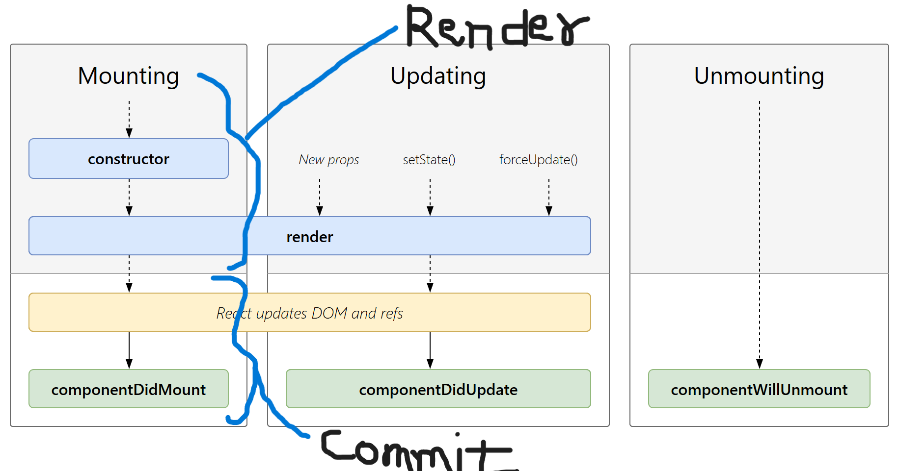

## Class Based Component

1. Basics :

   - Class based component is nothing but js class
   - has render method through which we return the jsx.
   - If we want to pass a props in class-based component then we have to recieve it using constructor method and then we have to use
     super(props).

   ```
   constructor(props){
     super(props);
   }
   ```

2. Why do we have to use super(props) inside contructor ?
   => 1. When there is no constructor then js invoke the default constructor and also initialize the parent class. 2. But when we define the constructor then we need initialize the parent class for that we have to use super. 3. It is very important to initialize the parent before accessing this because that is going to be derived in child classs.

3. How to create state variable in class component ? -
   => There is state object in class which contains all the state varibales.

   ```
   create the state variable inside the constructor
   constructor{
   this.state = {
    count:0,
   }
   }
   ```

4. How do we update the state variables ?
   => if we want to update the "count" state variable.

   ```
   Method-1 :

    this.state.count  = this.state.count+1;

   ```

   ## Note: Method-1 is wrong.[Never update the state variable directly it will not update]

   ```
   React gives setState object
   this.setState({
    count : this.state.count+1,
   })
   ```

## Note : loading a function on web page - means mounting it .

## Note - Loading a class on web page means creating an instance of it.

5. How react component get mounted on browser ? - Life Cycle method
   => Whenever some class component is invoked then first class's constructor is called then render is called.

6. 

7. React LifeCycle Method :

   - Mounting Started :

     - Constructor get invoked
     - Render method called
     - Dom get updated
     - ComponentDidMount called
     - After this we did setState(), new Props or Force update.
     - Mounting get completed.

   - Updating :
     - React update the dom again (Rerendering) After ComponentDidUpdate invoked.
   - UnMounting :
     - When we go to new PAGE then component will unMount.
       ComponentWillUnmount()

Note : Mounting means showing on to the UI and unmounting means disabling from the UI.

## Note : After first render ComponentDidMount() will be called and then after every subsequent render ComponenetDidUpdate will call.

## Note : Don't compare React Lifecycle with functional component.

## What is the use of ComponentWillUnMount() ?

=> For cleanup it can be use. Lot's of thing we need clear while shifting from 1 page to another page.

## But what cleanup ?

=> SPA also has cons, Let's say we call setInterval in our 1 of the component and if we don't clean up it then there will be performance issue saw the User class.

But why do we need the cleanup ?
=> Because let's say we have setInterval() inside the componentDidMount() now it runs the callback function after every sec now if I didn't clean it then that callback function unecessarily occupied the callstack/single thread this leads to performance issue.

## NOTE: We have to clean up in UseEffect also so we return the cleanup function in useEffect.

## Why can't we have the callback function of useEffect async? -->

=> Because useEffect Expect to return either cleanup function or undefined and async function implicitly return the promise and useEffect can't handle it so. the callback function inside useEffect can't be async but we can define async function inside callback function of useEffect and then call it in useEffect callback function itself.
